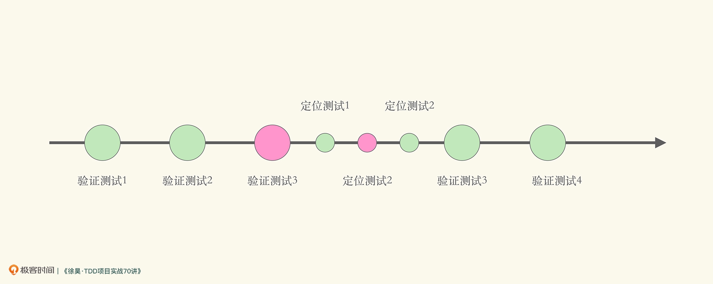
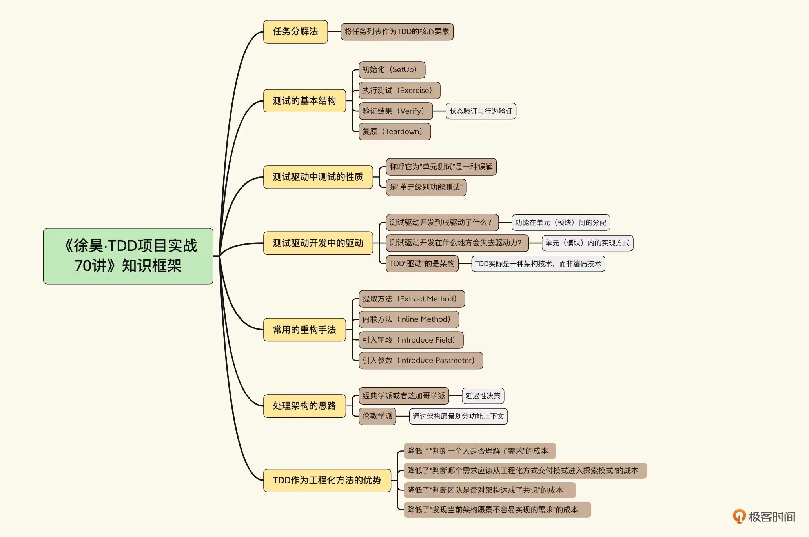

# 20230306

# 左耳听风

##  21 | 分布式系统架构的冰与火

`但 IBM 搞出来的 SOA 非常重，所以对 SOA 的裁剪和优化从来没有停止过。`
原来SOA是IBM整出来的, 整体的演进下面这个图挺经典的

不知为什么, 手机中`Martin Fowler 的 Microservices 这篇文章`这个没有打开
自己用电脑版再补一个链接[Microservices by Martin Fowler ](https://martinfowler.com/articles/microservices.html)

由于`spring cloud` `k8s`这些都已是通用的基础设施了, 因此与其自己再搞一个出来, 还不如好好地去学习这些, 以减轻以后团队迁移的负担.

结合到当前我所处的项目实际, 由于业务量还没有上去, 贸然地上分布式, 其实只有一个防单点故障的好处, 但会增加运维成本(如查日志之类的), 及增加系统的复杂性.

## 开篇词｜为什么TDD是当前最具工程效能的研发流程？

不过这些“程序员测试”并不表现为自动化测试，而是由“测试应用”、“跑一下”和“调试”等隐含手段体现的。

无计划的手动验证与有计划的自动化验证

“测试应用”和“跑一下”这两种技巧更多地关注在发现问题上，可以看作是“验证测试”。而“调试”通常发生在已经明显知道有错误的代码中，是一个定位错误的过程。

“调试”是一种启发式过程（Heuristic Procedure），更像是探索测试（Exploratory Testing），根据出现的错误寻找可能出现错误的位置，然后设置断点，判断该断点处的状态是否正确。

除了调试之外，我们还可以将代码划分成更小的单元，逐一排查以定位错误。那么我们就可以将对于某段代码的调试过程，转化成对于一组更小粒度单元的验证测试：

在软件开发中，一直都存在验证性测试和定位性测试两种测试。这也很好理解，我们既要知道代码有没有错误，还要知道当错误发生时，错误发生在哪里。 从定位性测试的角度出发，对比这两种做法，从意图上，我们可以粗略地认为，它们是对于同一种意图的两种不同实现：手动的启发式定位与有计划的逐模块自动化排查。所以如果你曾经也类似这样“调试”过你的应用，那么你就曾经在项目中做过“程序员定位测试”

测试构成了整个开发流程的骨架，功能开发可以看作填充在测试与测试之间的血肉。

验证测试与定位测试，本身就贯穿了整个软件构造的过程。测试构成了整个开发流程的骨架，功能开发可以看作填充在测试与测试之间的血肉。

也就是说，测试驱动开发将个体的开发活动，变成了工程化的研发过程。

它是以测试为里程碑点的工程化研发过程；同时，测试驱动开发将软件流程中无时无处不在的低效测试手段，以可重复的、高效的自动化测试代替，以获得更高的工程效能。

工程效能不仅仅是开发功能的效能，还包含发现问题、定位问题以及修复问题的效能。从理论上来说，后面三个并不是根本的复杂性问题

中发现错误，并准确定位错误，通过发现问题的测试和定位问题的测试可以高效实现。而如果说发现问题的测试，还有后置或外包于他人的可能，那么定位问题的测试，无论如何都没有办法了。所以实际上高效能的研发过程，至少需要我们提供可工作的代码，以及一组可用于定位问题的测试

D 的经典学派（芝加哥学派）与伦敦学派不同的切入点。

近年我研发的高效能工程方法 SEELE（Scalable Engineering Experience for Large Enterprise）也是将测试驱动开发作为核心流程，从而简化知识传递成本并提高杠杆率

测试驱动开发伴随了我职业生涯的每一个阶段。我相信，我掌握了测试驱动开发那天，我才成为了可靠、高效的职业程序员。如果你对程序员这个职业抱有严肃的态度，那么测试驱动开发是必须要掌握的。

-----------------------
# 固定片尾
此文单为3月Day06学习笔记, 内容来源于极客时间<<左耳听风>> <<TDD项目实战70讲>> 等, 强烈推荐该课程!
