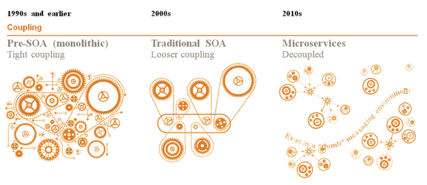
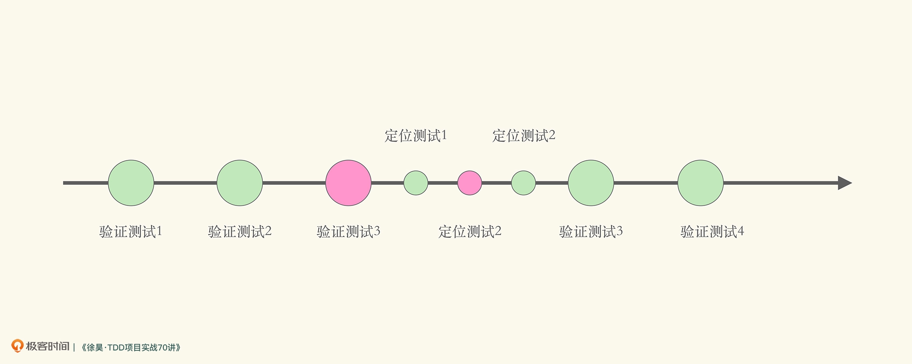
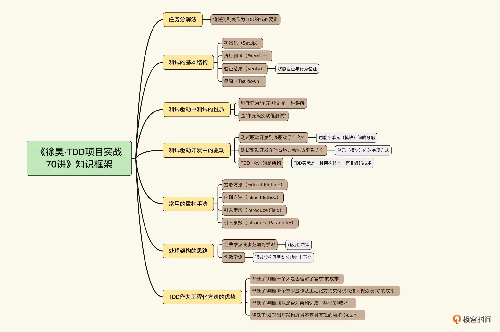

# 20230306

# 左耳听风

##  21 | [分布式系统架构的冰与火](https://time.geekbang.org/column/article/1411)

`但 IBM 搞出来的 SOA 非常重，所以对 SOA 的裁剪和优化从来没有停止过。`
原来SOA是IBM整出来的, 整体的演进下面这个图挺经典的




不知为什么, 手机中`Martin Fowler 的 Microservices 这篇文章`这个没有打开
自己用电脑版再补一个链接[Microservices by Martin Fowler ](https://martinfowler.com/articles/microservices.html)


由于`spring cloud` `k8s`这些都已是通用的基础设施了, 因此与其自己再搞一个出来, 还不如好好地去学习这些, 以减轻以后团队迁移的负担.


结合到当前我所处的项目实际, 由于业务量还没有上去, 贸然地上分布式, 其实只有一个防单点故障的好处, 但会增加运维成本(如查日志之类的), 及增加系统的复杂性.

## 开篇词｜[为什么TDD是当前最具工程效能的研发流程？](https://time.geekbang.org/column/article/494571)

不过这些“程序员测试”并不表现为自动化测试，而是由“测试应用”、“跑一下”和“调试”等隐含手段体现的。

无计划的手动验证与有计划的自动化验证

“测试应用”和“跑一下”这两种技巧更多地关注在发现问题上，可以看作是“验证测试”。而“调试”通常发生在已经明显知道有错误的代码中，是一个定位错误的过程。

“调试”是一种启发式过程（Heuristic Procedure），更像是探索测试（Exploratory Testing），根据出现的错误寻找可能出现错误的位置，然后设置断点，判断该断点处的状态是否正确。

除了调试之外，我们还可以将代码划分成更小的单元，逐一排查以定位错误。那么我们就可以将对于某段代码的调试过程，转化成对于一组更小粒度单元的验证测试：



在软件开发中，一直都存在验证性测试和定位性测试两种测试。这也很好理解，我们既要知道代码有没有错误，还要知道当错误发生时，错误发生在哪里。 从定位性测试的角度出发，对比这两种做法，从意图上，我们可以粗略地认为，它们是对于同一种意图的两种不同实现：手动的启发式定位与有计划的逐模块自动化排查。所以如果你曾经也类似这样“调试”过你的应用，那么你就曾经在项目中做过“程序员定位测试”

测试构成了整个开发流程的骨架，功能开发可以看作填充在测试与测试之间的血肉。

验证测试与定位测试，本身就贯穿了整个软件构造的过程。测试构成了整个开发流程的骨架，功能开发可以看作填充在测试与测试之间的血肉。

也就是说，测试驱动开发将个体的开发活动，变成了工程化的研发过程。

它是以测试为里程碑点的工程化研发过程；同时，测试驱动开发将软件流程中无时无处不在的低效测试手段，以可重复的、高效的自动化测试代替，以获得更高的工程效能。

工程效能不仅仅是开发功能的效能，还包含发现问题、定位问题以及修复问题的效能。从理论上来说，后面三个并不是根本的复杂性问题

中发现错误，并准确定位错误，通过发现问题的测试和定位问题的测试可以高效实现。而如果说发现问题的测试，还有后置或外包于他人的可能，那么定位问题的测试，无论如何都没有办法了。所以实际上高效能的研发过程，至少需要我们提供可工作的代码，以及一组可用于定位问题的测试

D 的经典学派（芝加哥学派）与伦敦学派不同的切入点。

近年我研发的高效能工程方法 SEELE（Scalable Engineering Experience for Large Enterprise）也是将测试驱动开发作为核心流程，从而简化知识传递成本并提高杠杆率

测试驱动开发伴随了我职业生涯的每一个阶段。我相信，我掌握了测试驱动开发那天，我才成为了可靠、高效的职业程序员。如果你对程序员这个职业抱有严肃的态度，那么测试驱动开发是必须要掌握的。




### 评论的摘抄


#### aoeTDD的心路历程

```
aoe
一、 告诉大家怎么2倍速观看视频（希望这个功能能得到优化）
鼠标点击右键->显示所有控件->竖着的三个点->播放速度->滑倒底部->2

二、 视频很精彩，非常高效的教学方式，本篇读后感：
1. 当有 private 方法不方便测试时，可以直接提取到一个新的类中变成 public 方法进行测试；同时也说明当前类违反了单一原则，可以及时重构
2. 我现在正发愁 SQL 怎么测！看来能在专栏找到答案了

三、 分享自己的 TDD 学习经历
1. 一次因为把赋值为 0 写成了 1 的 Bug，差点导致公司巨额损失，吓坏了，为了避免此类错误再次发生，最终的解决方案是 TDD
2. 凑巧学到了郑烨老师的专栏《软件设计之美》，带我看到了 TDD 如何入门：从单一原则则到各种原则可以推导出各种设计模式，符合单一原则的代码就是对测试友好的
3. 接着学习了郑烨老师的其他三个专栏《程序员的测试课》、《10X程序员工作法》、《代码之丑》。
   知道了一个方法如果行数太多很大原因是违反了单一原则：
   10行：郑烨老师的标准
   7行：《深入理解 Java 虚拟机》作者周志明老师的标准
4. 从郑烨老师的专栏中知道了两本神奇的书：《代码整洁之道》、《修改代码的艺术》
5. 阅读完《代码整洁之道》后发现还是无从进行 TDD 实践
6. 上网搜了一些国内外热心网友分享的 TDD 视频，开始模仿，虽然不专业，但总算实践了
7. 搜了一下 TDD 的书籍，买了两本：《Java 测试驱动开发》、《测试驱动开发的艺术》
8. 阅读完两本测试图书后知道了 Mockito，写起单元测试方便多了（渐渐理解代码需要对单元测试友好：单一原则、高内聚）
9.  《代码整洁之道》的作者 Bob 大叔说：重构最好的时机就是现在，但需要有单元测试做保障，工作中我也可以及时重构了
10. 正在阅读《修改代码的艺术》，期中 2.1 什么是单元测试中提到：
  单元测试运行很快。如果运行缓慢，那就不是单元测试。
  其他类型的测试经常会伪装成单元测试。如果出现以下情况，那么就不是单元测试：
  a. 测试会访问数据库
  b. 测试会通过网络通信
  c. 测试会访问系统文件
  d. 你需要做特定的工作配置环境来运行测试（例如编辑配置文件）
11. 知道了以前启动 SpringBoot 进行的测试是集成测试而不是单元测试，因为太慢了
12. 现在不知道数据库操作、HTTP请求、void 方法怎么进行单元测试，迷茫中
13. 徐昊老师、郑烨老师、Bob 大叔都在 Thoughtworks 工作过，本专栏让我久久不能平静
2022-03-18
```


#### 奇小易 2W2H笔记

```
奇小易
2W2H笔记
Why
Q1：为什么要学习TDD？
1、提高开发者的工程效能
工程效能包括（在开发过程中的）
- 开发功能速度
- 定位问题速度
- 发现问题速度
- 解决问题速度
2、可靠、高效的职业程序员

What
Q1: 程序员在所谓的"正常软件开发流程"中，都做过哪些测试？（或"程序员的测试"都有哪些？）
a、验证性测试
what: 什么是验证性测试？
意图是为了验证代码实现是否符合功能要求。
故在明确的代码执行下，产生的执行结果，要验证该结果是否符合预期。
基于该意图所做的验证操作就是验证性测试。
具体例子如：（测试应用、跑一下）
JPA示例中存储学生对象，最终预期就是将学生对象存入数据库中。
验证的方法就是验证下该对象是否真的存入了数据库。
而具体的验证手法可以通过人工查看的方式来实现，也可以通过编写测试代码来实现。
how good：验证性测试下有两种实现方式，分别是无计划的人工验证和有计划的自动化验证
b、定位性测试
what: 什么是定位性测试？
定位的意图是发现当前代码中存在问题，要快速定位问题，再来解决问题。
通常定位的手段是通过人工断点、打印等技巧，逐步分析错误范围，最终定位到问题，再加以解决。
而也可以通过给排查内容逐个增加验证测试，保证一个个测试通过的情况下，逐步缩小问题范围，从而定位到问题，再解决。
具体例子如：（调试）
how good：定位性测试下有两种实现方式，分别是人工启发式定位和有计划逐模块自动化排查。

Q2：测试驱动开发的核心逻辑是什么？
构造软件的过程可以理解为，通过完成一系列的验证测试（完成需求），然后在验证过程中发现问题，再完成定位测试（解决问题），如此往复，最终直到完成全部功能。
在这样的过程中，测试构成了整个开发流程的骨架，功能开发可以看做是填充到测试与测试之间的血肉。
核心逻辑一：以测试为里程碑点的工程化研发流程（不太理解）
可以看出软件开发过程被分解为完成一个个测试的过程。基于这种分解，能够规划研发流程的进度。（这里不太理解）
核心逻辑二：可重复、高效的自动化测试代替低效的人工测试
可以看出，测试在软件开发过程中无处不在，如此重要的行为，需要高效实现，故需要用高效的自动化手段来代替低效的人工测试手段。

Q3: 课程包含哪些内容？
1、命令行参数解析的示例
2、测试驱动开发的核心理论和方法
3、能够说服他人践行TDD的理由
4、三个示例（ioc容器，restApi框架、db mapper框架）
How
Q1：如何学习TDD？
A: 
1、多练习，在不同场景下练习
2022-04-06
```

## 课前必读01｜[20年前的“老古董”技术，为什么还值得开个课？](https://time.geekbang.org/column/article/495506)


`从一项技能被使用和理解的难度上来看，TDD 的复杂度是中等。更具体些来说，TDD 的学习复杂度大致低于熟练掌握一门编程语言，高于学习一个框架或者类库。`

`一看二动三对比`

在学完第一个实战项目后，我之前的很多疑惑都得到了解答。测试驱动开发，从名字上看很容易误解为不过是调换了写实现代码和测试代码顺序的一种开发方式，但实则不然。通过先写测试来不断地对自我进行验证和提问：对需求是否了解？对当前项目架构是否了解？当前架构是否到了需要演化的时间节点？来加强自身对需求和架构的关注，进而达到优化架构的目的。徐昊老师从各个方面系统地阐述了测试驱动开发到底是什么。因此，通过本门课的学习，让我更为全面地了解到了什么是测试驱动开发


### 评论

#### 奇小易2w2h笔记

```

How

Q: 学习TDD的难点和方法是什么？

A：

难点：

1、理解需求、将需求分解成功能点

方法：

1、在复杂场景下，反复练习。

2、一看二练三对比

（看老师的实战TDD的过程，自己尝试着走一遍，再对比下老师和自己的差别在哪里）
2022-04-07
```


-----------------------
## 固定片尾

此文单为3月Day06学习笔记, 内容来源于极客时间<<左耳听风>> <<TDD项目实战70讲>> 等, 强烈推荐该课程!
