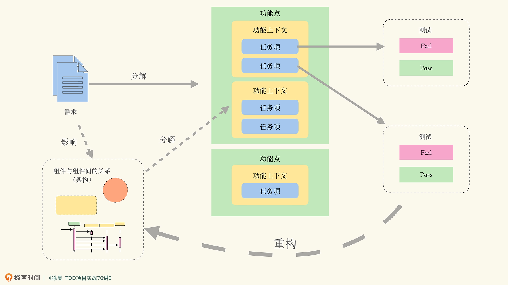
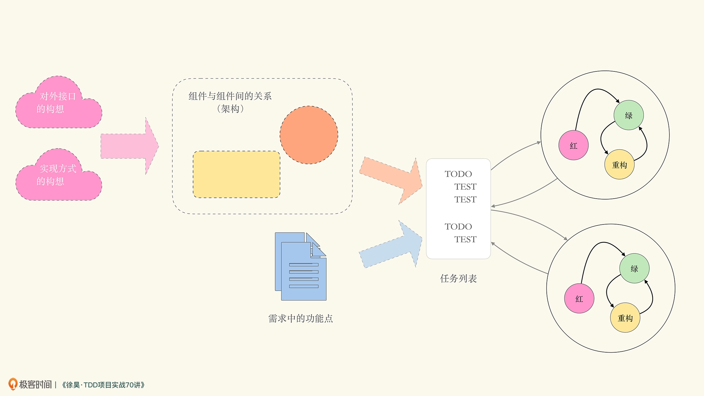

# 20230307


## 22 | [从亚马逊的实践，谈分布式系统的难点](https://time.geekbang.org/column/article/1505)

分布式服务化架构思想实践最早的公司应该是亚马逊

所有团队的程序模块都要通过 Service Interface 方式将其数据与功能开放出来。 团队间程序模块的信息通信，都要通过这些接口。 除此之外没有其它的通信方式。其他形式一概不允许：不能直接链结别的程序（把其他团队的程序当作动态链接库来链接），不能直接读取其他团队的数据库，不能使用共享内存模式，不能使用别人模块的后门，等等。唯一允许的通信方式是调用 Service Interface。 任何技术都可以使用。比如：HTTP、CORBA、Pub/Sub、自定义的网络协议等。 所有的 Service Interface，毫无例外，都必须从骨子里到表面上设计成能对外界开放的。也就是说，团队必须做好规划与设计，以便未来把接口开放给全世界的程序员，没有任何例外。 不这样做的人会被炒鱿鱼。

分布式服务的架构需要分布式的团队架构。在亚马逊，一个服务由一个小团队（Two Pizza Team 不超过 16 个人，两张 Pizza 可以喂饱的团队）负责，从前端到数据，从需求分析到上线运维。这是良性的分工策略——按职责分工，而不是按技能分工。

分布式服务架构是需要从组织，到软件工程，再到技术上的一个大的改造，需要比较长的时间来磨合和改进，并不断地总结教训和成功经验。

应该使用 Swagger 的规范了


一个好的配置管理，应该分成三层：底层和操作系统相关，中间层和中间件相关，最上面和业务应用相关。于是底层和中间层是不能让用户灵活修改的，而是只让用户选择

很多分布式架构在应用层上做到了业务隔离，然而，在数据库结点上并没有。如果一个非关键业务把数据库拖死，那么会导致全站不可用。所以，数据库方面也需要做相应的隔离。也就是说，最好一个业务线用一套自己的数据库。

有的能够添加出几万个监控指标。我觉得这完全是在“使蛮力”。一方面，信息太多等于没有信息，另一方面，SLA 要求我们定义出“Key Metrics”，也就是所谓的关键指标。然而，他们却没有。这其实是一种思维上的懒惰。

上述的都是在“救火阶段”而不是“防火阶段”。所谓“防火胜于救火”，我们还要考虑如何防火，这需要我们在设计或运维系统时都要为这些故障考虑，即所谓 Design for Failure。在设计时就要考虑如何减轻故障。如果无法避免，也要使用自动化的方式恢复故障，减少故障影响面。

因为当机器和服务数量越来越多时，你会发现，人类的缺陷就成为了瓶颈。这个缺陷就是人类无法对复杂的事情做到事无巨细的管理，只有机器自动化才能帮助人类。也就是，人管代码，代码管机器，人不管机器！

因为没有一个统一的运维视图，不知道一个服务调用是如何经过每一个服务和资源，也就导致在出现故障时要花大量的时间在沟通和定位问题上。

分工不是问题，问题是分工后的协作是否统一和规范。这点，你一定要重视

建分布式服务需要从组织，到软件工程，再到技术上的一次大的改造，需要比较长的时间来磨合和改进，并不断地总结教训和成功经验。

### 我自己的扩展阅读


为此, 我还自己找了一下[Swagger](https://swagger.io/)
```
API Development for Everyone
------------
Simplify API development for users, teams, and enterprises with the Swagger open source and professional toolset. Find out how Swagger can help you design and document your APIs at scale.
```
### 评论摘抄


#### 小羊

```
亚马逊经验：
1.分布式服务的架构需要分布式服务的团队
2.查错不易
3.运维优先，崇尚自动化和简化
4.无专职运维和测试，开发做所有事情
5.内部服务和外部服务一致

分布式系统问题：
1.异构系统不标准
2.故障率大
3.服务间依赖性问题
4.多层架构导致运维难度加大
```
#### 蚁内推+v

```
说下为什么API都返回200，在Body里写错误信息：因为有的运营商会拦截非200请求，然后返回广告😂
```


#### neohope

```
一说微服务架构，就一把鼻涕一把泪的。从单体结构到分布式，从来就不是一个单纯的技术问题，而是整个团队的思路都要转变，能力都要提升才行。我们从两年前起，开始从单体结构相分布式架构迁移，那一路过来的酸爽，现在闻起来还像泡在醋缸里一样。

最大的体会就是，程序员写服务爽了，实施或运维部署的时候难度一下加大了好多。以前排查问题找一个地方就行，现在各种中间件，各种服务，各种网络问题都要去看 。有一次，我们因为一个配置有问题，导致在特殊语句处理时数据库处理性能严重下降，dubbo全线卡死，最后导致服务全线雪崩，前方工程师没有经验，单纯的重启了服务，于是继续雪崩，就像被ddos攻击了一样。现在客户还各种质疑，“你们说了新架构很牛啊，怎么恢复用了这么久，排错用了这么久”。

每次遇到问题，就添加一类监控，磕磕碰碰的总算活了下来。回想下来，总是大家做了过多好的假设，但大家都知道，该发生的总会发生的。感觉我们现在仍把研发和实施分开，其实问题挺大的。
```

## 课前必读02｜[程序员究竟是搞技术的，还是做工程的？](https://time.geekbang.org/column/article/571577)


`技术能力和工程能力是同等重要的，但工程能力却是我们长期忽略和欠缺的`

在项目组做 CRUD 时，从技术上看，我们就是在做 CRUD。但与此同时，还需要理解“我为什么要做 CRUD”。这就牵扯到应该如何理解业务上下文和业务逻辑等问题。

因而在项目组做 CRUD 时，写代码可能仅仅占据整个代码生命周期的 5%。剩下的 95%，都是根据需求变化和功能调整，在 CRUD 的基础上再不断迭代

设在项目中出现“需求不会做”的情况，此时你面临着两个选择：一是马上向别人求助；二是先自己死磕，实在不行了再找人帮忙。我看弹幕里大多数人选择的是后者。

不要因为面子不想让别人知道自己不会，就选择先憋一憋。这样做，只会浪费团队的时间，给团队带来风险

向别人求助，难道不会浪费别人的时间吗？我要说的是：这不是由你决定的。

我可以将工程能力总结为：在团队协作环境下，长期稳定输出，并持续提高水平的能力

要知道，我们的生产效率之所以变得越来越慢，之所以出现不敢改祖传代码的情况，是因为所做的修改一旦出错，就无法定位到底是因为什么出的错。

如果所有人根据架构组件拆分出的功能点和功能上下文都是一致的，意味着架构愿景得到了一个比较好的规划，那么剩下的事情才会变得比较简单

`TDD 可以被看作是一种编程习惯或者编程方法。就像大家都在跑步，但每个人的摆臂、抬腿动作却不太一样。TDD 也是如此。所以当我去实际使用 TDD 时，对于 Kent Beck 个人的方法，比如三角法，会觉得好像没有什么必要。 于是我强迫自己用 TDD 来编写所有的程序。不光用 TDD 写过应用类的项目，还写过编译器。经过一年多的训练，我才觉得差不多掌握了 TDD。`

那么 TDD 是我认为目前效能最高的工程化的开发方法，当然，它也是难以掌握的


`如下图所示，是我在课程中主要使用的一张图。粗看上去，可能跟你理解的 TDD 有很大的偏差。`



在我们软件行业，大家非常关注自己个人的技术水平，而不强调工程实践的能力。所以我们行业里普遍缺乏这两种能力： 给我一个需求，我能够恰如其分地分解成对应的功能点； 给我一个架构愿景，我可以把功能点切分成对应的功能上下文。

另外一个挣扎的事情就是，使用 TDD 开发的程序员或多或少都有自己的风格和习惯，而别人的习惯和方法并不完全适用于我们。

建议不要把眼睛仅仅盯在技术能力上。比如 AI，需要追吗？除非你想立志成为 AI 工程师，否则更需要问的是：AI 何时会工程化？当 AI 工程化后，将会以何种形式与软件工程发生关系？当 AI 进入软件行业，我们做事的方法和风格会发生何种改变？

### 评论摘抄


#### 文经

```
我觉得光是这一讲加餐就值回票价了。
2023年的第一件重要的事就是跟着课程掌握TDD开发。

1. 工程能力和技术能力同等重要。
2. 工程能力是团队协作、长期稳定、持续提高。
3. TDD为什么是最具工程效能的实践。
4. TDD、重构、架构的关系。
5. TDD的学习、实践方法。
```

## 01｜[TDD演示（1）：任务分解法与整体工作流程](https://time.geekbang.org/column/article/494207)


那么 TDD 的整体工作流程如下图所示：



测试驱动开发，顾名思义，就是将软件需求转化为一组自动化测试，然后再根据测试描绘的场景，逐步实现软件功能的开发方法

毕竟，我想很多人对 TDD 心存质疑，最主要还是因为不光没吃过猪肉，其实也没见过猪跑吧

不过在今时今日，我认为第二条应该改为“消除坏味道（Bad Smell）”。毕竟重复仅仅是一种坏味道，还有很多不是重复的坏味道。

那么根据 TDD 的基本原则，Kent Beck 将开发工作分成了三步，也就是后世广为流传的测试驱动开发咒语——红 / 绿 / 重构（Red/Green/Refactoring）： 红：编写一个失败的小测试，甚至可以是无法编译的测试； 绿：让这个测试快速通过，甚至不惜犯下任何罪恶； 重构：消除上一步中产生的所有重复（坏味道）。

于是在 2006 年前后我总结了任务分解法，将任务列表作为 TDD 的核心要素

任务分解法的步骤如下： 大致构思软件被使用的方式，把握对外接口的方向； 大致构思功能的实现方式，划分所需的组件（Component）以及组件间的关系（所谓的架构）。当然，如果没思路，也可以不划分； 根据需求的功能描述拆分功能点，功能点要考虑正确路径（Happy Path）和边界条件（Sad Path）； 依照组件以及组件间的关系，将功能拆分到对应组件； 针对拆分的结果编写测试，进入红 / 绿 / 重构循环。

# 固定片尾
此文单为3月Day06学习笔记, 内容来源于极客时间<<左耳听风>> <<TDD项目实战70讲>> 等, 强烈推荐该课程!