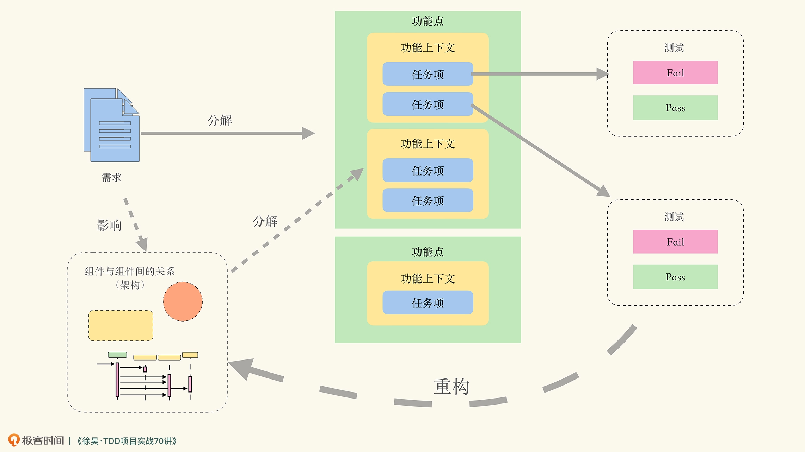

# 20230307

## 课前必读02｜程序员究竟是搞技术的，还是做工程的？

`技术能力和工程能力是同等重要的，但工程能力却是我们长期忽略和欠缺的`

在项目组做 CRUD 时，从技术上看，我们就是在做 CRUD。但与此同时，还需要理解“我为什么要做 CRUD”。这就牵扯到应该如何理解业务上下文和业务逻辑等问题。

因而在项目组做 CRUD 时，写代码可能仅仅占据整个代码生命周期的 5%。剩下的 95%，都是根据需求变化和功能调整，在 CRUD 的基础上再不断迭代

设在项目中出现“需求不会做”的情况，此时你面临着两个选择：一是马上向别人求助；二是先自己死磕，实在不行了再找人帮忙。我看弹幕里大多数人选择的是后者。

不要因为面子不想让别人知道自己不会，就选择先憋一憋。这样做，只会浪费团队的时间，给团队带来风险

向别人求助，难道不会浪费别人的时间吗？我要说的是：这不是由你决定的。

我可以将工程能力总结为：在团队协作环境下，长期稳定输出，并持续提高水平的能力

要知道，我们的生产效率之所以变得越来越慢，之所以出现不敢改祖传代码的情况，是因为所做的修改一旦出错，就无法定位到底是因为什么出的错。

如果所有人根据架构组件拆分出的功能点和功能上下文都是一致的，意味着架构愿景得到了一个比较好的规划，那么剩下的事情才会变得比较简单

`TDD 可以被看作是一种编程习惯或者编程方法。就像大家都在跑步，但每个人的摆臂、抬腿动作却不太一样。TDD 也是如此。所以当我去实际使用 TDD 时，对于 Kent Beck 个人的方法，比如三角法，会觉得好像没有什么必要。 于是我强迫自己用 TDD 来编写所有的程序。不光用 TDD 写过应用类的项目，还写过编译器。经过一年多的训练，我才觉得差不多掌握了 TDD。`

那么 TDD 是我认为目前效能最高的工程化的开发方法，当然，它也是难以掌握的

`如下图所示，是我在课程中主要使用的一张图。粗看上去，可能跟你理解的 TDD 有很大的偏差。`

在我们软件行业，大家非常关注自己个人的技术水平，而不强调工程实践的能力。所以我们行业里普遍缺乏这两种能力： 给我一个需求，我能够恰如其分地分解成对应的功能点； 给我一个架构愿景，我可以把功能点切分成对应的功能上下文。

另外一个挣扎的事情就是，使用 TDD 开发的程序员或多或少都有自己的风格和习惯，而别人的习惯和方法并不完全适用于我们。

建议不要把眼睛仅仅盯在技术能力上。比如 AI，需要追吗？除非你想立志成为 AI 工程师，否则更需要问的是：AI 何时会工程化？当 AI 工程化后，将会以何种形式与软件工程发生关系？当 AI 进入软件行业，我们做事的方法和风格会发生何种改变？

# 固定片尾
此文单为3月Day06学习笔记, 内容来源于极客时间<<左耳听风>> <<TDD项目实战70讲>> 等, 强烈推荐该课程!