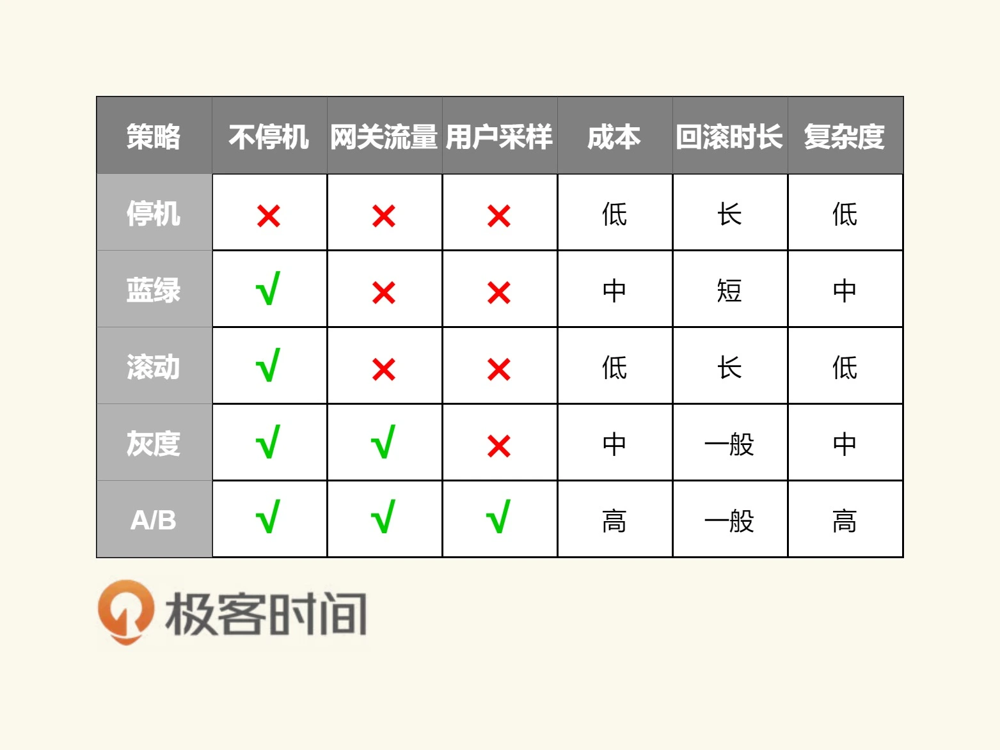

# 20230404

## [57 | 管理设计篇之“部署升级策略”](https://time.geekbang.org/column/article/6283)

### 停机部署

不会出现新老版本同时出现, 能保证一致性

### 蓝绿部署

需要双倍资源

### 灰度部署(金丝鹊部署)

90% 老版本, 
10% 新版本

在缺乏测试, 或没有测试条件, 或对版没信心
与AB测试不一样.

小结

## 固定片尾

此文单为4月学习笔记, 内容来源于极客时间<<左耳听风>> <<SQL必知必会作>> <<TDD项目实战70讲>> 等, 强烈推荐该课程!