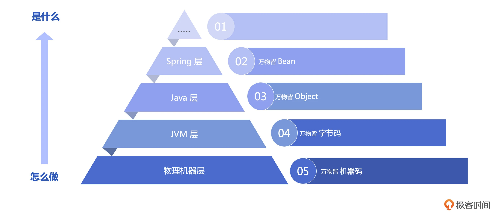

# 20231008

## [00| 开篇词 云时代来临，如何学好JVM应对未来的挑战？](https://time.geekbang.org/column/article/688761)

虽然 JDK 8 仍然被广泛采用，但是根据 New Relic 2023 年最新的报告统计，过去一年 JDK 17 的使用量增长了 430%，JDK 7 即将退出历史舞台，而 JDK 11 已经成为了使用量最高的 LTS 版本，占比达到了 56.06%。从 Graavlm 到 ZGC、从 AOT 到 Truffle，JVM 正以史无前例的更新速度和更新幅度，以自我颠覆性的方式准备迎接新时代的挑战.

因为平时不被我们关注的底层技术细节，往往会在关键时刻给我们致命的打击。比如在 JDK 1.8.0_131 之前，JVM 无法感知 Docker 的真实核数和内存大小，而是使用的宿主机核数和内存。这对于已经迁移上云的应用来说存在潜在的风险，如果你忽略这一点无疑会出大问题。

jdk LTS
版本	开始日期	结束日期
7（LTS）	2011年7月	2019年7月
8（LTS）	2014年3月	2022年3月
11（LTS）	2018年9月	2023年9月
17（LTS）	2021年9月	2026年9月

代码的未来》一书中讲到的：“闭包跟面向对象是一棵树上的两个分支，实现的功能是等价的。”其实闭包才是和面向对象互为依赖的一对概念，而面向过程还是面向函数，才是标准的编程的两大流派，代表着图灵与阿隆佐·邱奇之争。一个代表着逻辑与语言，一个代表着物理与抽象。

### comment

## [01｜重识JVM：JVM的起源、特性与系统构成](https://time.geekbang.org/column/article/688563)

区别于很多课程以“hello world”  开篇，我们今天从一个实际的需求开始。假设你是一家餐厅的老板，需要计算过去一周的营收总和，过去一周每天的营收分别是 102、230、320、431、130。假如你生活在公元前，这时候你可能就需要用结绳记事的方式来进行计算。而如果你生活在 19 世纪 50 年代，那么恭喜你，你可以用计算机帮你计算了。幸亏有了计算机，不然，如果要算一年的营收，不知道要用掉多少根绳子，算多长时间呢。

其实结绳记事也可以看作是最早的“计算机”，虽然它看上去与我们现在所使用的计算机大不相同，但其背后的原理，也就是信息的储存、处理与传递，却与我们现在所使用的计算机如出一辙。

整个计算机系统由层层抽象构建而成，硬件是基础，应用是表层，中间则是操作系统和各种各样的编程语言。

机器与语言

总的来说就是 Java 虚拟机在计算机硬件和 Java 程序之间建立了一个抽象层，使 Java 程序不必关心底层的硬件和操作系统的情况，从而实现了 Java“一次编写，到处运行”的效果。这也是 Java 语言相比其他语言的一大优势。

JDK 整体上包括 JRE（Java 运行时环境）、Javac（编译器）、Javadoc（文档生成器）、各种工具等，提供了从加载代码到验证代码再到执行代码的全生命周期管理。

我们从底层实现开始了解了 JVM 的起源，它其实就是一台冯. 诺依曼机器，和所有的计算机一样能协助你完成计算的任务。但是相对于普通计算机基于寄存器的架构，JVM 是基于栈的虚拟机，正是因为基于栈的特性，使 JVM 具备了平台无关性。和所有的语言一样，JVM 提供了自己的语言字节码以及字节码的运行时环境。虽然 JVM 是一台机器，但是它也是虚拟的，它的能力来源于底层真实的物理机，所以了解底层 CPU 和操作系统对你用好 JVM 大有裨益，因为它们是 JVM 的能力之源。当然面试的必考点 JVM 的内部构造我也着重介绍了下，这些都是需要你牢记于心的。

## 10月打卡挑战 · 详细规则
 

学习的境界有 3 种，知道、理解和内化。像看书、看文章、听课、看视频等方式，都是在被动灌输知识，只能让我们达到「知道」和「理解」的境界，知识留存度最多 30%。
 
而要达到「内化」境界，则要通过思辨、践行、总结和归纳，真正输出自己的知识地图。否则，就只是在机械地重复某件事（记忆知识），而难以内化为自己的知识。
 
我们希望为大家提供一个好的环境，引导大家「主动学习 + 总结输出」，「总结」的过程是将老师知识和自身知识建立连接的过程，而「输出」的过程是「以教代学」的过程，能助力大家最大程度将老师的知识内化为自身的知识。

 
活动时间

打卡期：10月1日~ 10月31日
发奖期：11月1日~11月7日期间

挑战内容

10月内，每天「学习」并「输出」，将输出的链接分享至群内，视为当天完成打卡 

挑战奖励

累计打卡7天，得3天学习卡
累计打卡15天，得7天学习卡
累计打卡21天，得14天学习卡
累计打卡28天，得21天学习卡！ 

具体如何打卡？

打卡流程：学习极客时间任意课程，在站外平台输出学习笔记，并将笔记分享链接至群内

站外平台：简书、知乎、CSDN、掘金、Github、思否、博客园、技术论坛，从这些平台任选一个平台输出笔记 

打卡要求

1.每天学习且在打卡平台输出 ≥ 100 字，将文章链接分享至社群内，视为当天打卡成功
2.打卡平台（任选）：简书、知乎、CSDN、掘金、Github、思否、博客园、技术论坛
3.文章要附上内容来源，格式：
●文章末尾附上「此文章为X月DayX学习笔记，内容来源于极客时间《课程名称》，强烈推荐该课程！/推荐该课程」，如果觉得这门课不值得推荐也可以不写最后一句话~
●不支持在标题中附内容来源，要使用正常文章标题噢，否则不计入统计~
4.大家可以在文章中带上自己的返现链接，这样其他人阅读了你们的文章进而买了课，你们就能得到现金奖励啦 

常见问题及帮助

Q：学习内容有什么要求？可以同时学习多门课打卡吗？

A：可以学习极客时间任意课程，也包括训练营课程。可以同时学多门课打卡。
 
Q：输出内容有什么方向、质量、字数的要求？

A：输出内容建议是学习任意课程的笔记。
 
好的笔记输出的是每次学习的收获（即认知变化、灵感&启发），主体是「我」，是「作者的思考对我的启发」，能建立作者知识与自身知识的关联，知识留存度能达到 70% 以上；一般的笔记是在摘录作者的思考和洞见，知识留存度只有30%。
 
我们对笔记内容不做硬性要求，只希望大家写出好的笔记，将自己的每一次学习效果最大化，享受思考的快乐。
 
Q：输出平台为什么限于简书、知乎、CSDN、Github、思否（SegmentFault）、掘金、技术论坛等技术平台，能输出在站内或非技术平台吗？

A：是的，本次活动只能输出在技术平台，我们希望大家的好笔记，能为极客时间提供品牌传播的力量。输出在站内或非技术平台，不计入奖励统计~
 
Q：笔记只限当天写完吗，还是说可以后续修改或补？

A：参与活动不是目的，养成学习习惯才是目的哦，笔记当天写，可以后续修改，但不支持后续补之前没写的笔记。
 
Q：如何兑换学习卡？

A： 11月1日~11月7日内会统一给完成挑战的同学通过下发学习卡哦，SVIP或超级会员任选~

## 固定片尾

此文单为10月学习笔记, 内容来源于极客时间<<云时代的 JVM 原理与实战>>等, 强烈推荐该课程!
