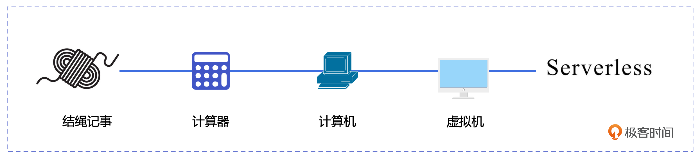
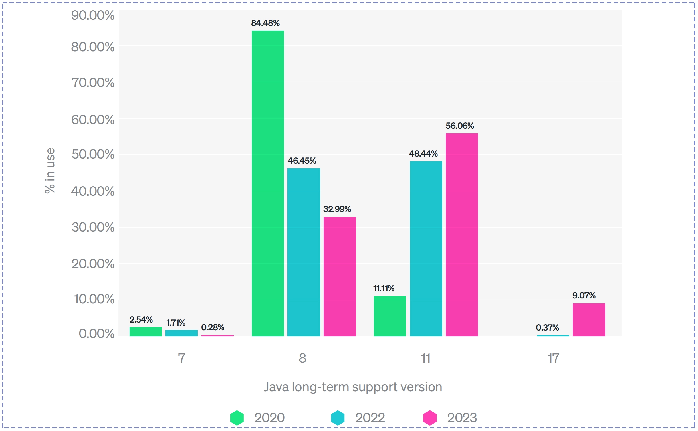
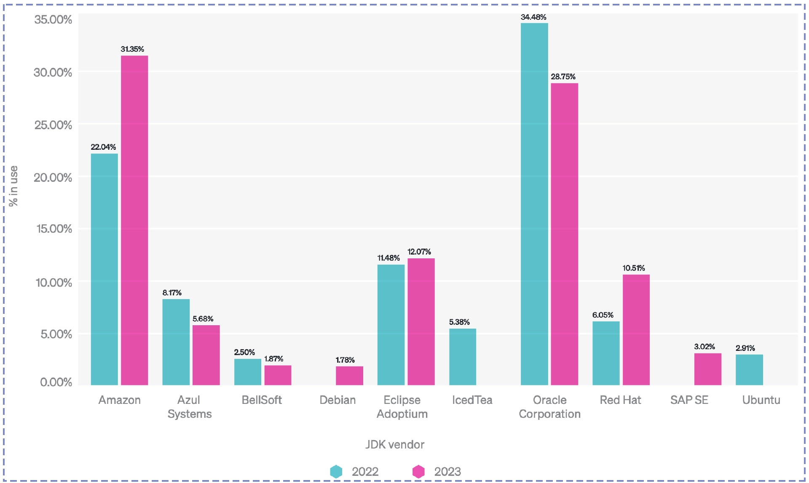

# 20231010

## [02｜挑战与趋势：云原生时代JVM的演进之路](https://time.geekbang.org/column/article/688784)

### 无服务器

云原生时代弱化了服务器的概念。我们可以这样理解，在云原生环境中，我们更侧重于解决问题本身，而不是关注解决问题的具体步骤或工具，也就是服务器。在这种情况下，解决问题的方法会变得越来越自然，不需要过多地关注具体的工具或步骤，就像是没有服务器存在一样。这就是所谓的 Serverless 的概念。

## 启动时间

首当其冲的就是启动时间，我们都知道 JVM 是个慢热型选手。它在启动时需要加载很多类文件，而如果你的应用需要在启动时候建立各种长链接，那启动时间基本上要以分钟来计算了。

## 启动性能

其次是启动性能，由于 JVM 需要在系统运行一段时间后才能逐步由解释执行转化为解释执行 + 编译执行，这也意味着 JVM 的系统需要经过一段时间的预热才能达到性能巅峰。这就像冬天的燃油车一样，必须先把发动机充分预热，才能真正上路。

## 面向对象

曾经 Java 语言就是面向对象的代名词，Java 的那句 Slogan：everything is object，即使没有使用过 Java 语言的人也都听说过。但是你是否思考过，面向对象是否是唯一的选择？everything is object 的成本是什么？
一个 32 位 Integer 对象在内存中的空间占用如下：
- 对象头部：Header，通常占据 8 个字节。用来存储对象的元数据信息，比如对象的类型指针、锁状态等。
- 实际存储的整数值：占据 4 个字节，用来存储 32 位整数的值。

因此，一个 32 位的 Integer 对象在运行时会占用 12 字节的内存空间。在实际情况中，JVM 为了对齐内存访问会把结构体的大小向上取整到 8 的倍数，所以通常会占用 16 字节的内存空间。这还不包括内存分配、垃圾回收、并发调用等耗费的其他资源成本。那面向对象是什么，是不是必需的呢？其实面向对象只是一种抽象客观世界的方式，随着“优先使用对象组合而非类继承”逐步被大家接受，面向对象的优势正在慢慢弱化。作为新一代编程语言的代表，Go 和 Rust 其实都摒弃了面向对象的概念，并快速地发展着。这也从侧面证明面向对象并不是必需的选择。所以如何在云时代平衡面向对象的优势和成本，也是 Java 要面临的挑战之一。

本来4byte就可以的事非得整出个16byte

## 容器亲和性

在 JDK 8u131 版本之前，JVM 不具备容器识别能力。这对于已经上云，但还在使用 JDK 8 的 Java 应用来说，存在致命的风险。因为 JVM 会基于宿主机的物理内存来设置堆内存的最大值，而不是基于容器的内存限制，从而导致 JVM 试图使用超出容器限制内存的情况出现，进而被操作系统杀掉，CPU 的使用也存在同样的问题。
在 JDK 11、JDK 17 中，JVM 增加了对容器环境的识别能力。JVM 会读取来自操作系统（Docker）和容器管理系统（Kubernetes）提供的信息，来了解它所在的容器的资源限制。JVM 会把这些信息用于堆内存、JIT 编译器的管理中，并且这些新增的功能是默认开启的，无需任何特殊的配置。

## 版本快速更迭

[《2023 年 Java 生态系统现状》](https://newrelic.com/sites/default/files/2023-04/new-relic-2023-state-of-the-java-ecosystem-2023-04-20.pdf)

## JVM 家族

可是在 New Reliic 的报告中，我们发现亚马逊才是现在最受欢迎的 JDK 供应商。因为 Oracle JDK 的商业收费政策、Open JDK 的蓬勃发展，再加上现在越来越热的信息技术应用创新，很多一线大厂开始打造自己的 JDK 版本。其中就包括阿里巴巴在 2019 年 3 月开源的 Dragonwell，腾讯 2019 年 11 月开源的 Kona，以及华为在 2020 年 9 月发布的毕昇。今天当你开始在生产环境中使用 Java 的时候，选择哪个 JDK 供应商已经成为了一个需要考虑的选项。

## 重点回顾

VM 经历了过去辉煌的 28 年，但在已经来临的云时代，原有的优势面临着新的挑战，为了适应云时代高性能、高可扩展性、高可靠性和高安全性的要求，JVM 也在努力地进行自我革新。
总的来说，JVM 的发展方向主要包括 3 个方面。

- 1. 首先是性能优化，通过提高性能和资源利用率来适应云原生时代的需求。其中最主要的技术是 AOT 编译器和 JIT 编译器的结合，以及 JVM 的内存管理和垃圾回收机制的优化。
- 2. 其次是对容器化的支持，通过支持容器化和新的微服务架构以适应云原生时代的需求。其中最主要的技术是 JVM 的镜像化和容器化以及对容器化环境的适配。
- 3. 最后是安全性和可靠性的提升，通过持续提高安全性和可靠性来适应新时代的要求。

我们也看到 JVM 版本的快速迭代和不断出现的 JVM 提供商，了解整个 JVM 的生态，对我们日后学习以及在生产中推进 JVM 的持续迭代有重要的意义

## 固定片尾

此文章为10月Day3学习笔记，内容来源于极客时间《云时代的 JVM 原理与实战》，强烈推荐该课程！/推荐该课程
