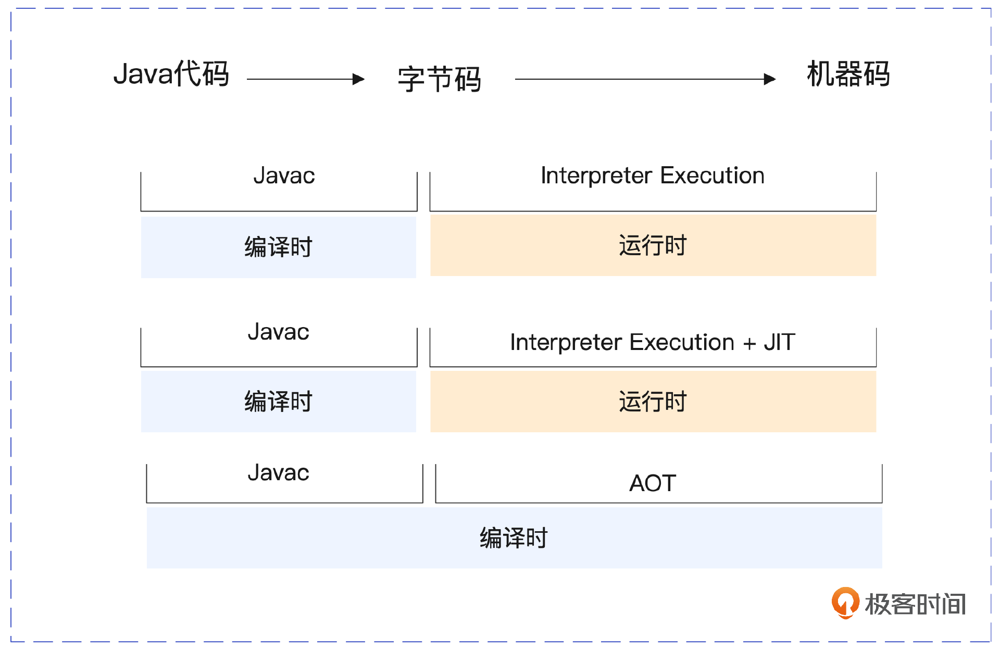
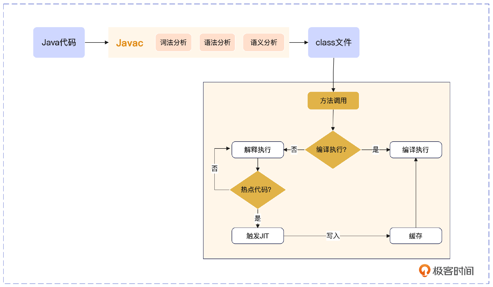

# 20231012

## 04｜从JIT到AOT：JVM编译器的云原生演进之路

## 字节码转化为机器码的发展历程

在 JVM 的演进历程中，字节码到机器码的转化环节共经历了三个发展阶段，分别是解释执行阶段、解释执行 + 编译执行阶段、提前编译阶段。

所以虽然主流的 JVM 依然是采用解释执行 + 编译执行的混合模式，但是更符合云原生要求的提前编译模式已经开始崭露头角。

### 提前编译（Ahead of Time Compilation）

提前编译也就是我们常说的 AOT。AOT 编译器是从 JDK 1.9 开始引入的 JEP 295 规范。与 JIT 编译器不同，AOT 是在程序运行前就把字节码编译成了机器码。

使用 AOT 编译器的优势在于你可以在部署应用程序前编译代码，而不是在运行时才编译，这可以减少应用程序启动时和运行时需要的 CPU 资源，优化资源的使用方式，减少启动延迟时间，提高性能。这就像你在入职一家公司之前，就提前了解并达到了对应岗位的技能要求，这样你在入职的第一天就能达到最佳的工作状态。

从最初的解释执行，到即时编译技术，再到最新推出的提前编译技术，JVM 在追求字节码执行性能提升的道路上，从依赖自身平台无关性的解决方案一步步转变到依赖云原生时代由容器提供平台无关性的解决方案上。下面我们就来详细聊一聊 JVM 中的 JIT 和 AOT 技术。

在实际的生产实践中，一般是将解释执行与编译执行结合起来使用，以达到最佳的性能。这背后的逻辑和 JVM 将堆分成新生代和老年代一样，除了 JVM 中对象的生命周期存在二八定律，我们所运行的代码也同样存在二八定律，也就是说 80% 的 CPU 时间是在处理 20% 的代码，这就是 JIT 可以通过深度优化热点代码来提升性能的原因。

## 固定片尾

此文章为10月Day5学习笔记，内容来源于极客时间《云时代的 JVM 原理与实战》，强烈推荐该课程！/推荐该课程